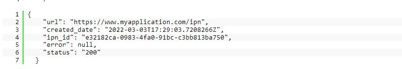
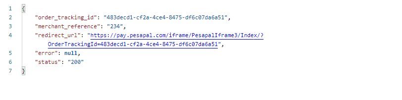
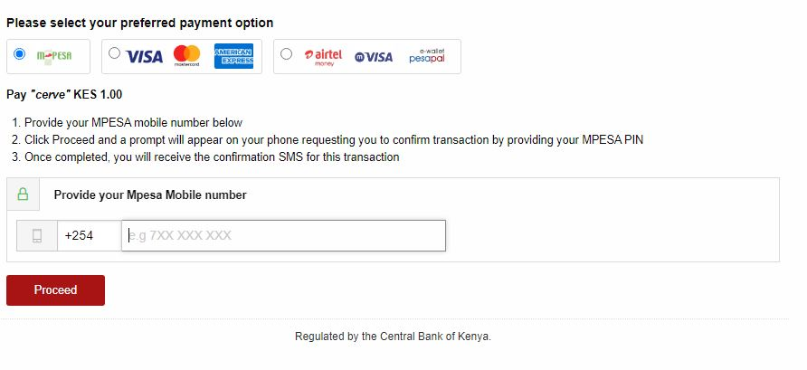
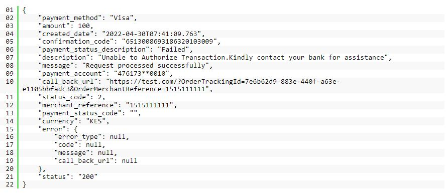

### **Pesapal V3 Package for Laravel Applications**

[](https://packagist.org/packages/nyawach/laravel-pesapal) [](https://packagist.org/packages/nyawach/laravel-pesapal) [](https://packagist.org/packages/nyawach/laravel-pesapal) [](https://packagist.org/packages/nyawach/laravel-pesapal) [](https://packagist.org/packages/nyawach/laravel-pesapal)

This package enables you to set up Pesapal V3 web payment in under 5 minutes
## Preinstallation requirements
1. Laravel 8* 
2. PHP 7.4 or higher
3. CURL installed

#### Installation
`composer require nyawach/laravel-pesapal`

#### configuration
To publish the pesapal config file and migrations run:

`php artisan vendor:publish --tag=pesapal-config`

##### Sample Config file

    //Please specify the environment pesapal is running on: production or sandbox

    'pesapal_env'=>env('PESAPAL_ENV'),


    /*
     * The application consumer key
     *
     */
    'consumer_key'=>env('PESAPAL_CONSUMER_KEY'),

    /*
     * The application consumer Secret
     */

    'consumer_secret'=>env('PESAPAL_CONSUMER_SECRET'),

    /*
     * It is a good practise to guard your routes. We will use
     * unique string to guard our callback and IPN Urls. Provide a random string to
     * to guard the endpoints
     */

    'pesapal_guard'=>env('PESAPAL_GUARD'),

    /*
     * After registering the IPN URL(s). Pesapal provides an IPN ID.
     * Copy that ID and save in you .env file. For a transaction to go through
     * it must have an ipn_id
     */


    'pesapal_ipn_id'=>env('PESAPAL_IPN_ID')


Refer to config/pesapal.php and create environment variable in your
.env file. See example below.

```
PESAPAL_ENV=production
PESAPAL_CONSUMER_KEY=qkio1BGGYAXTu2JOfm7XSXNruoZsrqEW
PESAPAL_CONSUMER_SECRET=osGQ364R49cXKeOYSpaOnT++rHs=
PESAPAL_GUARD=ahd55hrg57edhWYDGSS
PESAPAL_IPN_ID=eh93o68a-32g1-49jd-bb77-df7c4c2e37cb
```


PEASAPAL_ENV: Please specify whether the environment is sandbox or production
PESAPAL_CONSUMER_KEY and PESAPAL_CONSUMER_SECRET Production keys can be obtained [here](https://www.pesapal.com/dashboard/account/register). Sandbox or testing keys can be found [here](https://developer.pesapal.com/api3-demo-keys.txt) 
PESAPAL_GUARD: It is good practice to guard your callback and notification URLs. Think of a unique string and set it as your guard. This is how the URL will look like:
https://www.myapplication/callback/ahd55hrg57edhWYDGSS

PESAPAL_IPN_ID: For production use this [form](https://pay.pesapal.com/iframe/PesapalIframe3/IpnRegistration) to create IPN URLs and save the id. For testing or sandbox use this [form](https://cybqa.pesapal.com/PesapalIframe/PesapalIframe3/IpnRegistration). IPN URL can either be POST or GET choose the one you feel for comfortable with.

IPN stands for Instant Payment Notification. When a payment is made against a transaction, Pesapal will trigger an IPN call to the notification URL related to this transaction. This notification URL is usually located on your servers. These notifications allows you to be alerted in real time whenever there is a status change for any transaction.

An IPN is particular important as it allows you to be notified incase the following happens:

1. Your client gets disconnected after payment due to internet issues
2. Your client experiences server errors hence Pesapal and your application gets disconnected before callback URL is loaded.
3. Your client exits your application / closes the browser during payment.
4. The transaction is rejected.

##### Alternatively register IPN URLs 

In your controller

```php 
use Nyawach\LaravelPesapal\Facades\Pesapal;
class PesapalController extends Controller
{
public function getIpn(){
 $postData=array();
 //Sample Notification URL guarded by unique string
 $postData["url"]='https://mywebsite/getNotification/'.config('pesapal.pesapal_guard');
 /* IPN Notification type. 
 * This will tell Pesapal how to send the notification. As a POST or GET request
 */
 $postData["ipn_notification_type"]='POST';
 
 $register=Pesapal::registerIpn($postData);
 return $register:
}
}
```
Make sure you have saved the IPN id in your .env file.

A successful IPN registration response will look like this.



##### Submitting an order request
The way Pesapal works is that you submit an order request. A successful order will return a response containing order_tracking_id and an Iframe link.
you can render the payment iframe within your website or redirect users to the iframe link to make payments. Thereafter you can submit a request to get the 
payment status. 

It is also important that you save the order details in you database.

See below on how to submit an order request

```php
use Nyawach\LaravelPesapal\Facades\Pesapal;
use \Nyawach\LaravelPesapal\Models\Pesapal;

class PesapalController extends Controller
{
//submit an order request
 public function submitOrder(){
 $postData = array();
        $postData["language"] = "EN"; //nullable
        $postData["currency"] = "KES"; //This represents the currency you want to charge your customers. ISO formats
        $postData["amount"] = number_format(1,2); //must be float value and required
        $postData["id"] = 234; //Can be your unique order or product id and is required
        $postData["description"] = "Payment for order number AFED67"; //required
        $postData["billing_address"]["phone_number"] = "07XXXXXXXX";//client phone number required if email unavailable
        $postData["billing_address"]["email_address"] = "john.doe@example.com"; //client email address
        $postData["billing_address"]["country_code"] = "KE";//2 characters long country code in [ISO 3166-1]
        $postData["billing_address"]["first_name"] = "John";
        $postData["billing_address"]["middle_name"] = "Doe";
        $postData["billing_address"]["last_name"] = "Musa";
        $postData["billing_address"]["line_1"] = "";//nullable
        $postData["billing_address"]["line_2"] = "";
        $postData["billing_address"]["city"] = "Nairobi";//nullable
        $postData["billing_address"]["state"] = "Kenya";//nullable
        $postData["billing_address"]["postal_code"] = "";//nullable
        $postData["billing_address"]["zip_code"] = "";//nullable
        $postData["callback_url"] = "https://www.myapplication.com/response-page/".config('pesapal.pesapal_guard');//ensure you guard your callback url
        $postData["notification_id"] = config('pesapal.pesapal_ipn_id'); //IPN_id from your .env file
        $postData["terms_and_conditions_id"] = "";
        //return $postData;
        $order=Pesapal::getMerchantOrderURL($postData);
         
         /*
          * Save the transaction details to the database then later update
          * based on transaction status
          * Then render the iframe to present the user with a payment
          * interface
        
       */
       
       $transaction=new Pesapal()
       $transaction->tracking_id=$order->order_tracking_id
       $transaction->language=$postData['language'];
       $transaction->currency=$postData['currency'];
       $transaction->amount=$postData['amount'];
       $transaction->merchant_reference=$postData['id'];
       $transaction->decription=$postData["description"];
       $transaction->phone_number=$postData["billing_address"]["phone_number"] ; 
       $transaction->email_address=$postData["billing_address"]["email_address"];
       $transaction->country_code=$postData["billing_address"]["country_code"];
       $transaction->first_name=$postData["billing_address"]["first_name"];
       $transaction->middle_name=$postData["billing_address"]["middle_name"];
       $transaction->last_name=$postData["billing_address"]["last_name"];
       $transaction->billing_address_line_1=$postData["billing_address"]["line_1"];
       $transaction->billing_address_line_2=$postData["billing_address"]["line_2"];
       $transaction->city=$postData["billing_address"]["city"];
       $transaction->state=$postData["billing_address"]["state"];
       $transaction->postal_code=$postData["billing_address"]["postal_code"];
       $transaction->zip_code=$postData["billing_address"]["zip_code"];
       
       $transaction->save();
       
       //You only need to save fields that are important to you
       
       
 }

         
         
}
```

On a successful order request, you will get a response that looks like this


The redirect_url contains the iframe link. Redirect clients to the link
to complete the payment or render it on your website. See exsmple below how to render it

```html
<!--some page content here-->
<div>
    <iframe src="https://pay.pesapal.com/iframe/PesapalIframe3/Index/?OrderTrackingId=483decd1-cf2a-4ce4-8475-df6c07da6a51" height="100%" width="100%" title="Payment Iframe"></iframe>
</div>
<!--other page content here-->
```

This is how the payment iframe should look when rendered



Get Transaction Status
Once Pesapal redirect your customer to your callback URL and triggers your IPN URL, you need to check the status of the payment using the OrderTrackingId.

Transaction status returns transaction info and status code. This will allow you to update the transaction details based on the
status code. The status code are as follows:
* 0 - INVALID
* 1 - COMPLETED
* 2 - FAILED
* 3 - REVERSED

See example below on how to request transaction status:
```php
use Nyawach\LaravelPesapal\Facades\Pesapal;
use \Nyawach\LaravelPesapal\Models\Pesapal;

class PesapalController extends Controller{

//callback url function

public  function pesapalCallback(Request $request){
   $transaction_status=Pesapal::getTransactionStatus($request->OrderTrackingId)
   /*
    * Based on the transaction status_code you can update the transaction details as
    * failed  or complete. If the transaction is not complete
    * you can redirect the users to attempt the payment again.
    */
    
    //if the transaction is complete
    
    if ($transaction_status->status_code===1){
    $order=Pesapal::where('tracking_id',$request->OrderTrackingId)->firstOrFail();
     //check if the amounts match
     if ($order->amount==$transaction_status->amount){
      $order->status=$transaction_status->status_code
      $order->save()
      //redirect user to another page. Maybe thank you page
     }else{
     // do something else if the amounts do not match
     }
    }else{
     //do something else such redirecting users to attempt the payment again
    }
}

}

```
A successful get transaction status should return a response that looks
similar to the one below.



#### Security and Vulnerabilities
If you discover a security vulnerability within laravel-pesapal, please send an e-mail to Joshua Nyawach via nyawach41@gmail.com. All security vulnerabilities will be promptly addressed.

#### License
Laravel-pesapal is an open source software licensed under the [MIT License](https://opensource.org/licenses/MIT)
